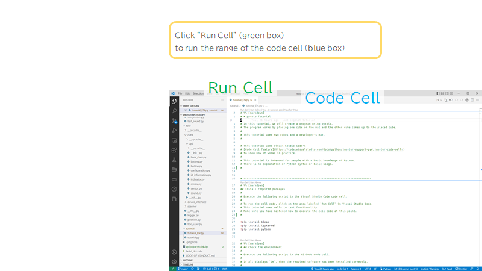
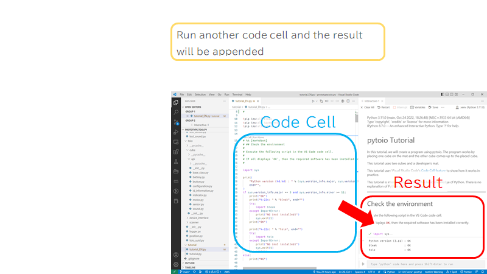

# toio.py setup guide

This is a setup guide of toio.py (library for controlling [toio™Core Cube](https://toio.io/platform/cube/) from Python).

## System requirements

### Primary tested environment

- Windows: Windows10 (21H2)

### Secondary tested environment

- Linux: Ubuntu22.04
- macOS: macOS 12 (Monterey)

## Install (Windows)

## Install [Python](https://www.python.org/) (Version 3.11 or later)

### Install Python

Install Python by referring to [Using Python on Windows](https://docs.python.org/3/using/windows.html).
Install Python 3.11 or later.

### Install related packages

Open a command prompt.

Type the following command to install these Python packages.

#### setuptools

Update setuptools to latest.

```
python -m pip install setuptools --upgrade
```

#### toio.py

Execute the following command to install.

```
python -m pip install toio-py --upgrade
```

#### bleak

```
python -m pip install bleak
```

#### ipykernel

```
python -m pip install ipykernel
```


**Confirmation**

Execute the following command at the command prompt.

```
python -c "import toio.scanner; print('ok')"
```

If you see `ok`, toio.py has been successfully installed.

If you get an ImportError, the installation did not work.
If you try to install toio.py again, and it does not work
Try reinstalling Python.

**For reference: ImportError message**

If you get this message, you have failed to install.

```
Traceback (most recent call last):
  File "<string>", line 1, in <module>
ModuleNotFoundError: No module named 'toio.scanner'
```

## Install [Visual Studio Code](https://code.visualstudio.com/)

Refer to [Python in Visual Studio Code](https://code.visualstudio.com/docs/languages/python) to install Visual Studio Code and Python Extensions.

After the Python extension installed, install the Jupyter extension.

Search for `Jupyter` using the same procedure as for installing Python extensions.

Install the following Jupyter extensions from Microsoft


## Running the tutorial

Download [tutorial.en.py](https://github.com/toio/toio.py/releases/latest/download/tutorial.en.py).
Open `tutorial.py` on Visual Studio Code.

The tutorial can be read while actually executing code using Visual Studio Code's [Code Cell feature](https://code.visualstudio.com/docs/python/jupyter-support-py#_jupyter-code-cell).

### Visual Studio Code's code cell feature

Visual Studio Code has the ability to execute partial Python code in the document individually (code cell executor).

When you open tutorial.py, you will see the text separated by several blue horizontal lines, as shown in the following screenshot.

The area delimited by the blue line is a single code cell.


Click on the words `Run Cell` in the upper left corner to run a single code cell.



Enlarged view of the `Run Cell` section.


**Additional Information: If you do not see `Run Cell`**

If Visual Studio Code is running in Restricted Mode, the Code Cell feature will not work. If you see Restricted Mode in the lower left corner of the Visual Studio Code window, click on the Restricted Mode text and set the window to Trusted Window.

**Restricted Mode**


**Trusted Window Setup Screen**


The results of the execution of the code cell are displayed on the right side.


When other code cells are executed, the results of the execution of those code cells are added.



---

# API document

The API document is [here](https://toio.github.io/toio.py/).
