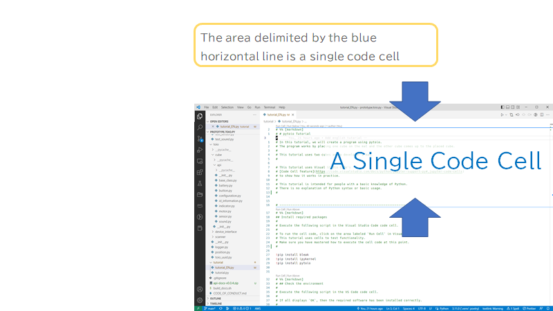
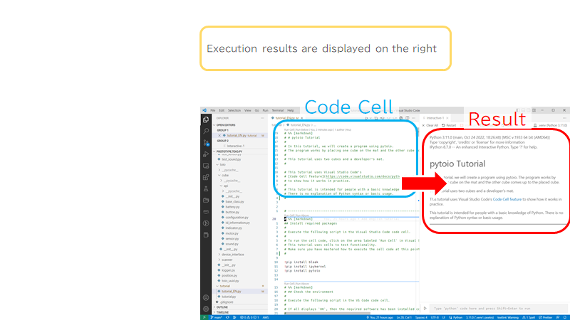

# toio.py技术指导手册

该文档是一个toio.py（可以使用Python控制Q宝(https://toio.io/platform/cube/)的库）的设置指导手册。

## 系统要求

- Windows: Windows10 (21H2)

## 本指导手册以Windows操作系统为示例，若使用MAC或liunx操作系统，可参考以下内容自行设置。
## Installation (Windows)
## 安装（Windows版本），并确认系统版本为win10

## 下载 Python 3.11或更高版本(https://www.python.org/)

### 安装 Python

若显示安装失败，可参照[Using Python on Windows](https://docs.python.org/3/using/windows.html)进行重新安装。
注意：python版本一定要3.11或更高版本。

### 完成以上流程后，接下来需要安装相关软件包，操作如下：

#### bleak
#### 安装bleak软件包，命令如下：

```
python -m pip install bleak
```

#### ipykernel
#### 安装ipykernel软件包，命令如下：

```
python -m pip install ipykernel
```

#### toio.py
#### 安装toio.py软件包，命令如下：

```
python -m pip install toio-py --upgrade
```

**确认**

在命令提示符下执行以下命令进行验证，查看toio.py是否按照成功。

```
python -c "import toio.scanner; print('ok')"
```

若屏幕中显示“ok”，说明toio.py已成功安装。

若屏幕中显示“ImportError”，说明导入失败，请尝试重新安装.wh1文件，并确保已经进入到保存该文件的目录中。
若再次显示安装失败
请检查python的版本，确保python版本为3.11及以上

**供参考：导入错误信息**

如果屏幕显示以下信息，说明安装失败。

```
Traceback (most recent call last):
  File "<string>", line 1, in <module>
ModuleNotFoundError: No module named 'toio.scanner'
```

## 安装 Visual Studio Code (https://code.visualstudio.com/)

参考 [Python in Visual Studio Code](https://code.visualstudio.com/docs/languages/python)，安装Visual Studio Code和Python扩展。

安装完Python扩展后，安装Jupyter扩展。
使用与安装Python扩展相同的程序搜索 "Jupyter"。
在Visual Studio Code中安装Jupyter扩展


## 运行教程

在Visual Studio Code上导入“[tutorial.py](https://github.com/toio/toio.py/releases/latest/download/tutorial.py)”。

在实际执行代码时可以阅读该教程去使用Visual Studio Code的[代码单元功能](https://code.visualstudio.com/docs/python/jupyter-support-py#_jupyter-code-cell)

### Visual Studio Code的代码单元功能

Visual Studio Code 具有单独执行文档中部分 Python 代码的能力（代码单元执行器）。
当你打开 tutorial.py 时，你会看到文本被几条蓝色的横线隔开，如下面的截图中所示。
由蓝线划定的区域是一个单独的代码单元。




点击左上角的“运行单元”字样来运行一个单一的代码单元。


点击左上角的“运行单元”字样来运行一个单一的代码单元。


**附加信息：如果你没看到“运行单元”**

如果Visual Studio Code在限制模式下运行，代码单元功能将无法工作。如果你在Visual Studio Code窗口的左下角看到 "限制模式"，请点击 "限制模式 "文本，并将该窗口设置为 "信任窗口"。

**限制模式**


**受信任的窗口设置界面**


代码单元的执行结果显示在右侧。



当其他代码单元被执行时，这些代码单元的执行结果会被加入。


---

# API 文件

https://toio.github.io/toio.py/
