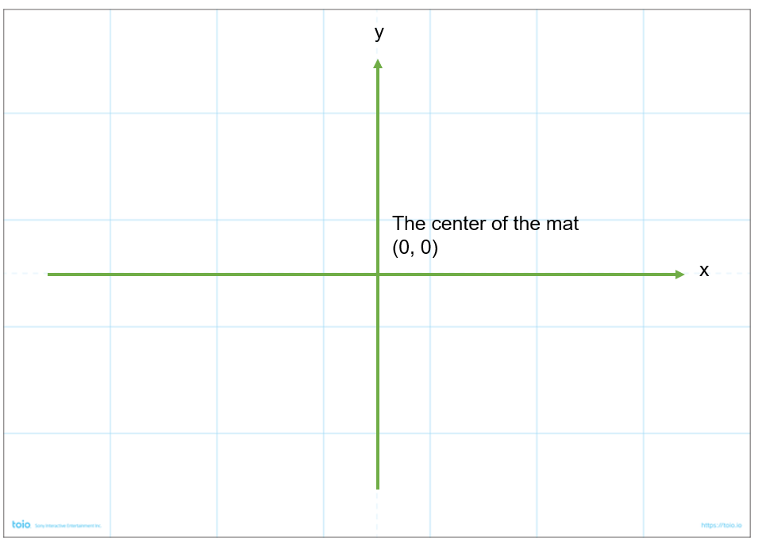
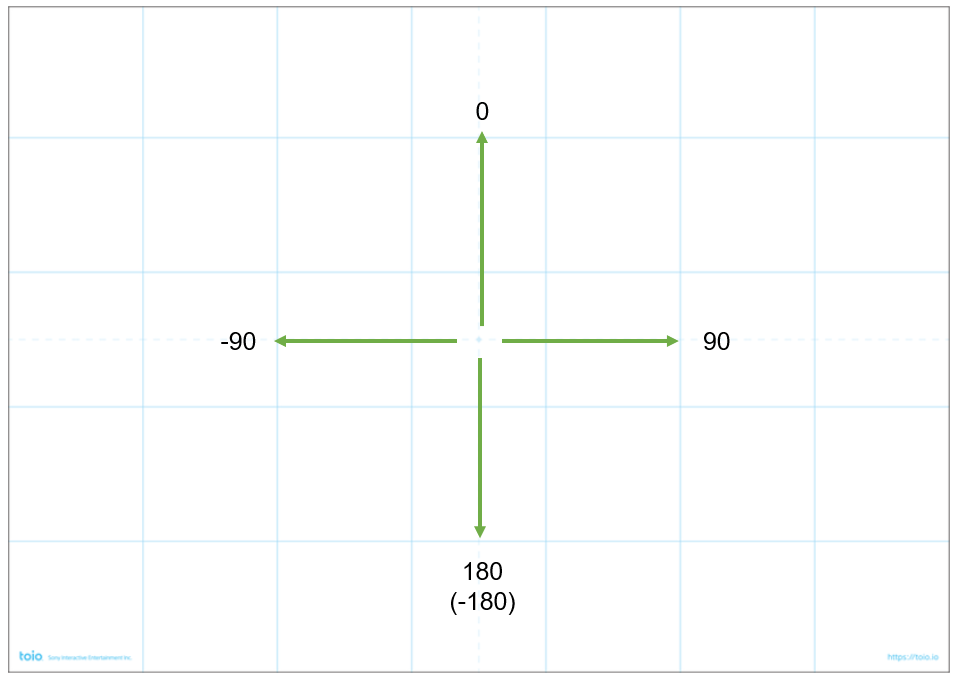

# SimpleCube API

簡単に toio コアキューブにアクセスするための API

- シンプル
- 非同期処理なし
- キューブのスキャンが不要
- Visual Programming のブロックとほぼ同じ機能を持った関数

---

## 例

### モーター制御

```Python
import sys

from toio.simple import SimpleCube


def test():
    with SimpleCube() as cube:
        cube.move(30, 3)
        cube.spin(60, 2)
        cube.run_motor(70, 10, 1)
        cube.run_motor(10, 70, 1)
        cube.run_motor(-20, -20, 0)
        cube.sleep(0.5)
        cube.stop_motor()

if __name__ == "__main__":
    sys.exit(test())
```

### モーター制御 （指定位置まで移動）

```Python
import sys

from toio.simple import SimpleCube


def test():
    targets = ((30, 30), (30, -30), (-30, -30), (-30, 30), (30, 30))
    with SimpleCube() as cube:
        for target in targets:
            target_pos_x, target_pos_y = target
            print(f"move to ({target_pos_x}, {target_pos_y})")
            success = cube.move_to(speed=70, x=target_pos_x, y=target_pos_y)
            print(f"arrival: {success}")
            if not success:
                print("Position ID missed")
                break
            cube.sleep(0.5)


if __name__ == "__main__":
    sys.exit(test())
```

### 位置情報の読み取り

```Python
import signal
import sys

from toio.simple import SimpleCube

LOOP = True


def ctrl_c_handler(_signum, _frame):
    global LOOP
    print("Ctrl-C")
    LOOP = False


signal.signal(signal.SIGINT, ctrl_c_handler)


def test():
    with SimpleCube() as cube:
        while LOOP:
            pos = cube.get_current_position()
            orientation = cube.get_orientation()
            print("POSITION:", pos, orientation)
            cube.sleep(0.5)


if __name__ == "__main__":
    sys.exit(test())
```

### その他のサンプルコード

その他のサンプルコードは、examples-simple ディレクトリにあります。

---

## API 一覧

```Python
    # 接続と切断
    SimpleCube(name: Optional[str] = None, timeout:int = 5, log_level: int = NOTSET) -> None:
    disconnect():

    # モーター制御と移動
    move(speed: int, duration: float) -> None:
    spin(speed: int, duration: float) -> None:
    run_motor(left_speed: int, right_speed: int, duration: float,) -> None:
    stop_motor() -> None:
    move_steps(direction: Direction, speed: int, step: int) -> bool:
    turn(speed: int, degree: int) -> bool:
    move_to(speed: int, x: int, y: int) -> bool:
    set_orientation(speed: int, degree: int) -> bool:
    move_to_the_grid_cell(speed: int, cell_x: int, cell_y: int) -> bool:

    # 位置情報の取得
    get_current_position() -> Optional[tuple[int, int]]:
    get_x() -> Optional[int]:
    get_y() -> Optional[int]:
    get_orientation() -> Optional[int]:
    get_grid() -> Optional[tuple[int, int]]:
    get_grid_x() -> Optional[int]:
    get_grid_y() -> Optional[int]:
    is_on_the_gird_cell(cell_x: int, cell_y: int) -> bool:

    # カード情報の取得
    is_touched(item: StandardIdType) -> bool:
    get_touched_card() -> Optional[StandardId]:

    # その他の情報の取得
    get_cube_name() -> Optional[str]:
    get_battery_level() -> Optional[int]:
    get_3d_angle() -> Optional[tuple[int, int, int]]:
    get_posture() -> Optional[int]:
    is_button_pressed() -> Optional[int]:

    # ランプ制御
    turn_on_cube_lamp(r: int, g: int, b: int, duration: float) -> None:
    turn_off_cube_lamp() -> None:

    # 音制御
    play_sound(note: int, duration: float) -> bool:
    stop_sound() -> None:

    # 磁石の検出
    is_magnet_in_contact() -> Optional[int]:

    # 時間待ち
    sleep(sleep_second: float):

```

---

## API 説明

### 接続と切断

#### `SimpleCube(name: Optional[str] = None, timeout:int = 5, log_level: int = NOTSET) -> None:`

`SimpleCube`オブジェクトを生成します。
生成時にキューブを検索して接続します。

| 引数      | 説明                             |
| --------- | -------------------------------- |
| name      | 接続するキューブの固有 3 桁 ID   |
| timeout   | スキャンのタイムアウト時間（秒） |
| log_level | ログレベル                       |

##### 使用例

下記のコードは

- 近くのキューブに接続
- キューブを１秒間、速度 50 で前進
- 切断

を行います。

```Python
cube = SimpleCube()
cube.move(50, 1)
cube.disconnect()
```

`SimpleCube()` はコンテキストマネージャなので、`with` 文を使うことができます。
`with` ブロックを抜ける際には自動的に`disconnect()`が呼ばれます。
さきほどのコードは、`with`文を使うことにより下記のように書けます。

```Python
with SimpleCube() as cube:
  cube.move(50, 1)
```

`disconnect()`が呼ばれず、Cube と接続したままの状態でプログラムが終了した場合には
後のプログラム実行でキューブと接続できないことがあります。
確実に切断するため、`SimpleCube()`は`with`文での使用を推奨します。

##### 接続対象となるキューブについて

`SimpleCube()` が引数 `name` を持たない場合、`SimpleCube()` は周囲の キューブを探し、
電波が一番届きやすいキューブへ接続を試みます。
周囲にキューブが見つからない場合は`ValueError`例外が発生します。

引数 `name` に固有 3 桁 ID の文字列が指定されている場合、指定されたキューブへの接続を試みます。
指定されたキューブが見つからない場合は`ValueError`例外が発生します。

##### Windows に関する特記事項

Windows は Bluetooth 機器として OS にキューブを登録できます。  
登録されているキューブが接続対象として優先されます。

Windows で動作している場合、接続対象キューブは下記の順番で決まります。

**Window での接続順番：`name`指定ありの場合**

1. OS に登録されているキューブで`name`が一致しているもの
2. 見つからなかった場合は、実際にスキャンを行い`name`が一致したもの

**Window での接続順番：`name`指定なしの場合**

1. OS に登録されているキューブのうち電波が一番届きやすいもの
2. 見つからなかった場合は、実際にスキャンを行い電波が一番届きやすいもの

#### `disconnect()`

キューブとの接続を解除します。

`disconnect()`が呼ばれず、Cube と接続したままの状態でプログラムが終了した場合には次の実行で接続に失敗することがあります。
プログラム終了時には確実に切断してください。

### モーター制御と移動

#### `move(speed: int, duration: float) -> None:`

キューブを動かします。

| 引数     | 説明           | 指定可能な値          |
| -------- | -------------- | --------------------- |
| speed    | モーターの速度 | -100 &lt;= speed &lt;= 100  |
| duration | 動作時間（秒） | 0 &lt;= duration &lt;= 2.55 |

`speed` に正の値を指定すると前進します。負の値を指定すると後進します。

`duration` に 2.55 より大きい値を設定した場合は 2.55 として扱われます。  
`duration` に 0 を指定した場合は「制限時間なし」となります。このとき `move()`は完了を待たず、キューブと通信を行ったあとすぐにリターンします。

#### `spin(speed: int, duration: float) -> None:`

キューブをその場で回転させます。

| 引数     | 説明           | 指定可能な値          |
| -------- | -------------- | --------------------- |
| speed    | モーターの速度 | -100 &lt;= speed &lt;= 100  |
| duration | 動作時間（秒） | 0 &lt;= duration &lt;= 2.55 |

`speed` に正の値を指定すると反時計回りに、負の値を指定すると時計回りに回転します。

`duration` に 2.55 より大きい値を設定した場合は 2.55 として扱われます。  
`duration` に 0 を指定した場合は「制限時間なし」となります。このとき `move()`は完了を待たず、キューブと通信を行ったあとすぐにリターンします。

#### `run_motor(left_speed: int, right_speed: int, duration: float,) -> None:`

キューブのモーターを左右別々の速度で動かします。

| 引数        | 説明                 | 指定可能な値              |
| ----------- | -------------------- | ------------------------- |
| left_speed  | モーターの速度（左） | 100 &lt;= left_speed &lt;= 100  |
| right_speed | モーターの速度（右） | 100 &lt;= right_speed &lt;= 100 |
| duration    | 動作時間（秒）       | 0 &lt;= duration &lt;= 2.55     |

`left_speed`, `right_speed` はそれぞれ正の値を指定すると前進方向に、負の値を指定すると後進方向に回転します。

`duration` に 2.55 より大きい値を設定した場合は 2.55 として扱われます。  
`duration` に 0 を指定した場合は「制限時間なし」となります。このとき `move()`は完了を待たず、キューブと通信を行ったあとすぐにリターンします。

#### `stop_motor() -> None:`

キューブのモーターを止めます。

#### `move_steps(direction: Direction, speed: int, step: int) -> bool:`

※ この関数はマットが必要です。マットがない場所では動作しません。

マットの上でキューブを指定された歩数だけ進めます。

| 引数      | 説明           | 指定可能な値                           |
| --------- | -------------- | -------------------------------------- |
| direction | 進行方向       | Direction.Forward / Direction.Backward |
| speed     | モーターの速度 | -100 &lt;= speed &lt;= 100                   |
| step      | 歩数           | 0 &lt;= step                              |

#### `turn(speed: int, degree: int) -> bool:`

※ この関数はマットが必要です。マットがない場所では動作しません。

この関数が呼ばれた時点のキューブの向きを基準として、キューブを `degree` で指定された角度だけ回転させます。

| 引数   | 説明           | 指定可能な値         |
| ------ | -------------- | -------------------- |
| speed  | モーターの速度 | -100 &lt;= speed &lt;= 100 |
| degree | 角度           | |

#### `move_to(speed: int, x: int, y: int) -> bool:`

※ この関数はマットが必要です。マットがない場所では動作しません。

キューブを指定された座標へ動かします。

| 引数  | 説明           | 指定可能な値         |
| ----- | -------------- | -------------------- |
| speed | モーターの速度 | -100 &lt;= speed &lt;= 100 |
| x     | 目標位置 (x)   | |
| y     | 目標位置 (y)   | |

#### `set_orientation(speed: int, degree: int) -> bool:`

※ この関数はマットが必要です。マットがない場所では動作しません。

キューブの向きを指定された角度に向けます。

| 引数   | 説明           | 指定可能な値         |
| ------ | -------------- | -------------------- |
| speed  | モーターの速度 | -100 &lt;= speed &lt;= 100 |
| degree | 角度           | |

#### `move_to_the_grid_cell(speed: int, cell_x: int, cell_y: int) -> bool:`

※ この関数はマットが必要です。マットがない場所では動作しません。

キューブを指定されたマス位置へ動かします。

| 引数   | 説明                 | 指定可能な値         |
| ------ | -------------------- | -------------------- |
| speed  | モーターの速度       | -100 &lt;= speed &lt;= 100 |
| cell_x | マットのマス位置 (x) | |
| cell_y | マットのマス位置 (y) | |

### 位置情報の取得

#### `get_current_position() -> Optional[tuple[int, int]]:`

※ この関数はマットが必要です。マットがない場所では動作しません。

キューブがいる座標を `(x座標, y座標)` のタプルで返します。

キューブの位置が正しく検出できていない場合には `None` が返ります。

#### `get_x() -> Optional[int]:`

※ この関数はマットが必要です。マットがない場所では動作しません。

キューブがいる x 座標を整数値で返します。

キューブの位置が正しく検出できていない場合には `None` が返ります。

#### `get_y() -> Optional[int]:`

※ この関数はマットが必要です。マットがない場所では動作しません。

キューブがいる y 座標を整数値で返します。

キューブの位置が正しく検出できていない場合には `None` が返ります。

#### `get_orientation() -> Optional[int]:`

※ この関数はマットが必要です。マットがない場所では動作しません。

キューブの角度を整数値で返します。

キューブの位置が正しく検出できていない場合には `None` が返ります。

#### `get_grid() -> Optional[tuple[int, int]]:`

※ この関数はマットが必要です。マットがない場所では動作しません。

キューブがいるマスの位置を `(x位置, y位置)` のタプルで返します。

キューブの位置が正しく検出できていない場合には `None` が返ります。

#### `get_grid_x() -> Optional[int]:`

※ この関数はマットが必要です。マットがない場所では動作しません。

キューブがいるマスの x 位置を整数値で返します。

キューブの位置が正しく検出できていない場合には `None` が返ります。

#### `get_grid_y() -> Optional[int]:`

※ この関数はマットが必要です。マットがない場所では動作しません。

キューブがいるマスの y 位置を整数値で返します。

キューブの位置が正しく検出できていない場合には `None` が返ります。

#### `is_on_the_gird_cell(cell_x: int, cell_y: int) -> bool:`

※ この関数はマットが必要です。マットがない場所では動作しません。

キューブが指定されたマスの場所にいるかどうかを返します。
いる場合は `True` が、いない場合は `False` です。

| 引数   | 説明                 | 指定可能な値 |
| ------ | -------------------- | ------------ |
| cell_x | マットのマス位置 (x) | |
| cell_y | マットのマス位置 (y) | |

### カード情報の取得

#### `is_touched(item: StandardIdType) -> bool:`

| 引数 | 説明         | 指定可能な値                                                   |
| ---- | ------------ | -------------------------------------------------------------- |
| item | カードの種類 | [standard_id.py](./toio/standard_id.py) で定義されているカード |

下記コードはキューブが簡易マットの数字 0 に触れていると `Number 0` を表示します。

```Python
if cube.is_touched(StandardIdCard.NUMBER_0):
    print("Number 0")
```

#### `get_touched_card() -> Optional[StandardId]:`

キューブが現在触れているカードの種類を返します。

触れているカードがない場合は `None` を返します。

### その他の情報の取得

#### `get_cube_name() -> Optional[str]:`

現在接続しているキューブの名前を返します。

キューブの名前が正しく取得できていない場合は `None` を返します。

#### `get_battery_level() -> Optional[int]:`

現在のバッテリーレベルを。0 から 100 までの整数値で返します。

キューブからバッテリーレベルが正しく取得できていない場合は `None` を返します。

#### `get_3d_angle() -> Optional[tuple[int, int, int]]:`

現在のキューブの姿勢角を `(ロール、ピッチ、ヨー)` のタプルで返します。

キューブから姿勢角が正しく取得できていない場合は `None` を返します。

姿勢角についての詳しい情報は[toio コアキューブ技術仕様 姿勢角情報の取得（オイラー角）](https://toio.github.io/toio-spec/docs/ble_high_precision_tilt_sensor#%E5%A7%BF%E5%8B%A2%E8%A7%92%E6%83%85%E5%A0%B1%E3%81%AE%E5%8F%96%E5%BE%97%E3%82%AA%E3%82%A4%E3%83%A9%E3%83%BC%E8%A7%92%E3%81%A7%E3%81%AE%E9%80%9A%E7%9F%A5)を参照してください。

#### `get_posture() -> Optional[int]:`

現在のキューブの姿勢（姿勢角ではありません）を 1 から 6 までの整数値で返します。

キューブの姿勢が正しく取得できていない場合は `None` を返します。

キューブの姿勢についての詳しい情報は[toio コアキューブ技術仕様 姿勢検出](https://toio.github.io/toio-spec/docs/ble_sensor#%E5%A7%BF%E5%8B%A2%E6%A4%9C%E5%87%BA)を参照してください。

#### `is_button_pressed() -> Optional[int]:`

現在のキューブのボタンの状態を取得します。

返値とボタン状態の関係は下記です。

| 返値 | ボタン状態     |
| ---- | -------------- |
| 0    | 押されていない |
| 128  | 押されている   |

ボタンの状態が正しく取得できていない場合は `None` を返します。

### ランプ制御

#### `turn_on_cube_lamp(r: int, g: int, b: int, duration: float) -> None:`

ランプを点灯します。

| 引数     | 説明           | 指定可能な値  |
| -------- | -------------- | ------------- |
| r        | 赤成分         | 0 &lt;= r &lt;= 255 |
| g        | 緑成分         | 0 &lt;= g &lt;= 255 |
| b        | 青成分         | 0 &lt;= b &lt;= 255 |
| duration | 発光時間（秒） | 0 以上        |

#### `turn_off_cube_lamp() -> None:`

ランプを消灯します。

### 音制御

#### `play_sound(note: int, duration: float) -> bool:`

音を鳴らします。

| 引数     | 説明           | 指定可能な値             |
| -------- | -------------- | ------------------------ |
| note     | 音程           | 0 &lt;= note &lt;= 127         |
| duration | 発音時間（秒） | 0.01 &lt;= duration &lt;= 25.5 |

`note` に指定する数値と音程の関係は[toio コアキューブ技術仕様 MIDI note number と Note name](https://toio.github.io/toio-spec/docs/ble_sound#midi-note-number-%E3%81%A8-note-name)を参照してください。

#### `stop_sound() -> None:`

音を止めます。

### 磁石の検出

#### `is_magnet_in_contact() -> Optional[int]:`

磁石の状態を返します。

値と磁石位置の関係は[toio コアキューブ技術仕様 磁石のレイアウト仕様](https://toio.github.io/toio-spec/docs/hardware_magnet#%E7%A3%81%E7%9F%B3%E3%81%AE%E3%83%AC%E3%82%A4%E3%82%A2%E3%82%A6%E3%83%88%E4%BB%95%E6%A7%98)を参照してください。

### 時間待ち

#### `sleep(sleep_second: float):`

指定時間だけ待ちます。

| 引数         | 説明           | 指定可能な値 |
| ------------ | -------------- | ------------ |
| sleep_second | 待ち時間（秒） | 0 以上       |

`time.sleep()`を使うと Python インタプリタが全体的に停止してキューブとの通信も停止してプログラムが正常に動作しません。

`move()`などの関数を「制限時間なし」で動作させた場合など、キューブの動作についての待ち時間処理を行う場合はこの関数を利用してください。

下記はキューブを速度 50, 制限時間なしで動作させ、10 秒待ってから停止させるコードです。

```Python
cube.move(50, 0)
cube.sleep(10)
cube.stop_motor()
```

## マットの原点とキューブの向き

### 原点

マットの中心が `(0, 0)` になります。



### 向き

マット上方向が 0°、下方向が 180° になります。


